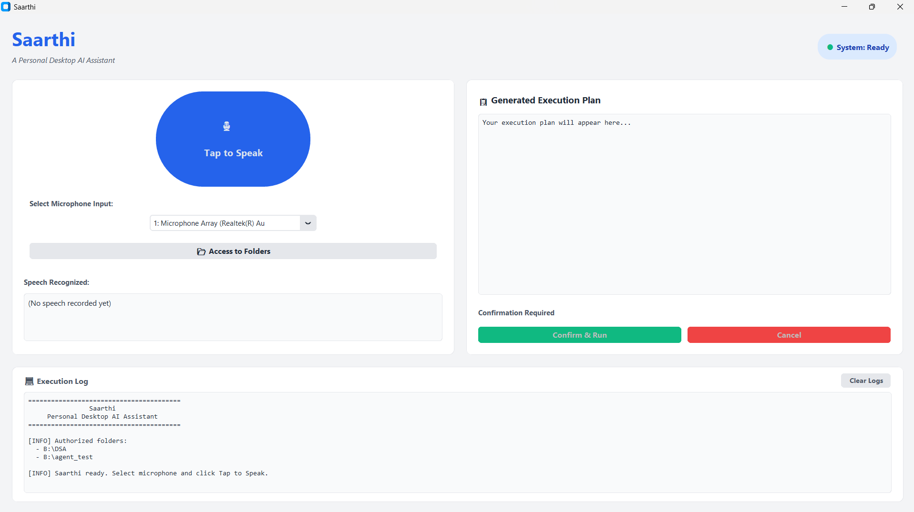
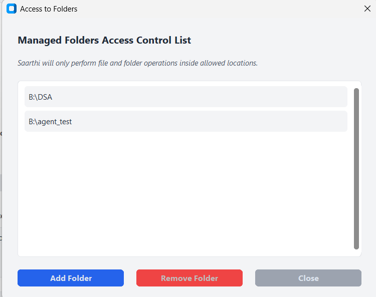
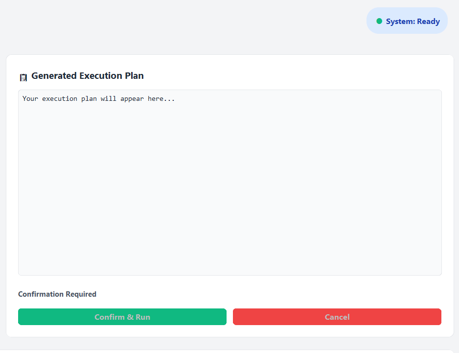
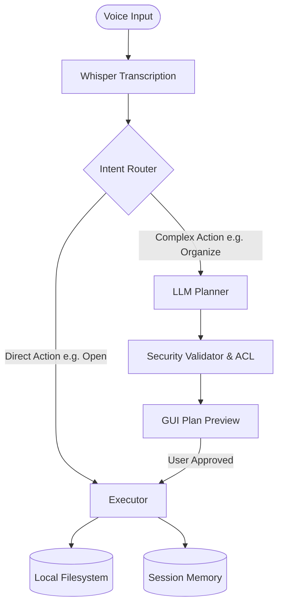

# Saarthi

### A Personal Desktop AI Assistant

A desktop AI assistant that understands natural language commands and safely automates local file and folder operations using offline speech recognition, local language models, and structured planning.

***

## 📌 Overview

**Saarthi** (meaning *guide* or *charioteer*) is a personal desktop AI assistant that performs local file and folder automation using natural language, offline speech recognition, and local language models. 

### Why Safe Execution Matters
Traditional AI agents run shell commands directly on the host system. Saarthi secures this by executing only pre-validated Python filesystem operations within user-authorized directories (ACL), with explicit approval required for all multi-step plans.

***

## 🖼️ Screenshots

 **Main Dashboard**
 
  
--
**Access to Folders (ACL)** | **Plan Confirmation Dialog**|
| :---: | :---: |
|  |  |

***

## ✨ Key Features

* 🎙️ **Voice-Controlled Interaction**: Capture commands hands-free via default microphone.
* 🔌 **100% Offline Processing**: Fast CPU transcription via `faster-whisper` and local LLM planning via `Ollama` (`llama3.2:3b`).
* 🔗 **Context-Aware Follow-up**: Supports pronouns (*"it"*, *"this folder"*, *"that file"*) to reference previously resolved paths.
* 🛡️ **Allowed Folders ACL**: Security boundary restricting operations strictly to user-authorized directories.
* 🔍 **Recursive Fuzzy Search**: Searches allowed paths recursively with case-insensitive matching and optional file extensions.
* 🚀 **Immediate Launching**: Automatically opens resolved directories or files in system-native applications.
* 🗑️ **Impact Previews**: Locks input and displays exact plan steps, folder changes, and file counts before execution.
* 🖥️ **Modern GUI**: Polished desktop dashboard styling built with CustomTkinter.

***

## ⚙️ How it Works



1. **Transcription & Routing**: Speech is transcribed locally and routed by intent (direct actions vs. planned tasks).
2. **Context Resolution**: Pronouns are mapped to the last successfully resolved file/folder path.
3. **Plan Generation**: Ollama generates a structured JSON execution plan.
4. **Validation**: The sandboxed validator grounds paths and halts if any step attempts to access folders outside the ACL.
5. **Approval & Run**: The GUI shows the impact estimate and waits for user confirmation before executing.

***

## 📂 Project Structure

```text
Saarthi/
├── memory/         # Context tracking, path resolver, and sqlite persistence
├── planner/        # Intent classifier, Ollama LLM node, and LangGraph pipeline
├── tools/          # Sandboxed actions registry, search engine, and plan validator
├── voice/          # Audio stream capture and faster-whisper transcription
├── build_exe.py    # Bundles python codebase into a single standalone EXE
├── gui.py          # Main CustomTkinter desktop interface
├── main.py         # Alternative interactive command-line interface
└── requirements.txt# Pinned Python package dependencies
```

***

## 🚀 Installation & Launching

### Option 1: Run the Executable (Recommended for Users)
No Python installation or environment setup is required:
1. Download and install Ollama from [ollama.com](https://ollama.com/).
2. Run the model in your terminal:
   ```bash
   ollama pull llama3.2:3b
   ```
3. Run `Saarthi.exe` directly.

---

### Option 2: Run from Source (For Developers)
Requires Python `3.10` or `3.11`.

1. **Clone the repository & create environment**
   ```bash
   git clone https://github.com/sagar-24bytes/Saarthi-ai.git
   cd Saarthi-ai
   python -m venv .venv
   .venv\Scripts\activate
   ```

2. **Install requirements**
   ```bash
   pip install -r requirements.txt
   ```

3. **Pull model & run app**
   ```bash
   ollama pull llama3.2:3b
   python gui.py
   ```

---

### Option 3: Build the Windows Executable

To package Saarthi into a standalone Windows executable:

```bash
python build_exe.py
```
The generated executable will be created in the dist/ directory.
***

## 🎙️ Example Voice Commands

| Intent Category | Voice Commands |
| :--- | :--- |
| **Open** | *"Open agent test folder"*, *"Open DSA folder"*, *"Open testing.pdf"* |
| **Organize** | *"Organize the current folder"*, *"Clean up agent_test"* |
| **Search** | *"Search for testing.pdf"*, *"Look for project file"* |
| **Context Follow-up** | *"Organize it"*, *"Open it"* |
| **App Control** | *"Exit"*, *"Quit"*, *"Close Saarthi"* |

***

## 🛡️ Safety Model
* **ACL Boundary**: Saarthi blocks execution instantly if a plan targets directory levels outside authorized paths.
* **Confirmation Gate**: Previews estimated files affected and requires manual approval click for plan steps.
* **Local Processing**: Audio recordings are deleted immediately after transcription. No data leaves your machine.
* **Standard Lib APIs**: Commands run via controlled python `os` and `shutil` calls rather than arbitrary shell string commands.

***

## 🛠️ Technologies Used

| Technology | Purpose |
| :--- | :--- |
| **CustomTkinter** | Polished UI widgets, log views, and popups. |
| **Ollama (Llama 3.2:3b)** | Local reasoning LLM backend for task planning. |
| **LangGraph** | Pipeline state machine coordinating planning and validation. |
| **Faster-Whisper** | Fast, CPU-optimized offline Speech-to-Text transcription. |
| **SQLite** | Local memory database for folder permissions and state context. |
| **Sounddevice & SciPy** | Hardware microphone capture and downsampling processing. |

***

## ⚠️ Limitations & Future Scope

### Current Limitations:
* Optimized for Windows operating systems.
* Speech recognition and planning prompts configured for English language commands.
* Automated actions limited to local directory management and file searches.

### Future Scope:
* Cross-platform compilation for macOS and Linux.
* OCR integration to organize files based on contents.
* Local vector RAG database for semantically searching document texts.

***

## 🤝 Contributing
Feel free to fork the repository, open issues, or submit Pull Requests to help improve Saarthi's capabilities!

***

## 📄 License
Distributed under the MIT License. See LICENSE for more details.
